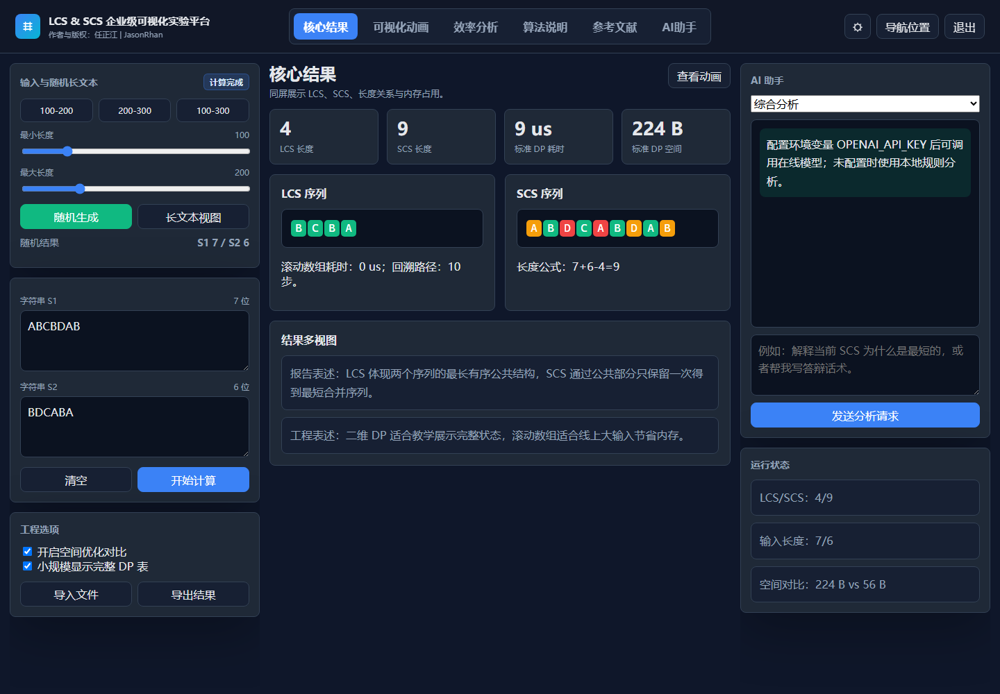

# 从 LCS 到 SCS：用 C++17 和浏览器可视化完成字符串动态规划课程项目

作者：任正汗 | JasonRhan
版权：Copyright 2026 JasonRhan

最长公共子序列（LCS）和最短公共超序列（SCS）是字符串动态规划中的典型问题。它们适合用来展示状态定义、递推公式、路径回溯、序列构造和复杂度对比。本项目把算法核心放在 C++17 中实现，再编译为 WebAssembly，由 React 前端负责交互和可视化。

项目的目标不是只给出一个字符串答案，而是把动态规划的中间状态完整展示出来。页面中可以看到 DP 表如何从边界状态开始填充，也可以切换到 LCS 回溯和 SCS 构造动画。对于较长输入，系统提供独立动画页面，顶部保留操作区，下方展开表格，避免主页面被超长内容挤压。

LCS 的状态定义为 `dp[i][j]`：字符串 `S1` 的前 `i` 个字符和 `S2` 的前 `j` 个字符的最长公共子序列长度。当 `S1[i-1] == S2[j-1]` 时，状态来自左上角并加一；否则来自上方或左方的较大值。完成填表后，从右下角回溯即可得到一条 LCS 路径。

SCS 复用 LCS 的 DP 表构造结果。两个字符相同时只写入一次公共字符；不相同时选择能保持 LCS 最优性的方向，并把对应字符加入结果。长度关系为 `|SCS| = |S1| + |S2| - |LCS|`，这也解释了为什么 SCS 可以建立在同一张 LCS 表之上。

项目还加入了滚动数组和 Hirschberg 算法，用于对比标准二维 DP 的时间与空间表现。效率分析页会批量生成不同规模的输入，绘制耗时趋势、空间柱状图、优化比例和效率散点图，并提供 CSV/JSON 数据模板。

参考文献页采用紧凑列表展示论文，不再在列表页内嵌预览。点击论文后会进入独立阅读页面：左侧显示 PDF，右侧加载 AI 问答窗格。使用者可以直接询问论文来源、核心观点、与 LCS/SCS 的关系，以及基础代码实现思路。

1.0.4 版本还重构了前端目录：`features` 负责业务页面，`components` 负责通用组件，`hooks` 负责状态和动作，`utils` 负责路由与上下文，`config` 负责版本、标签和预设配置。这样的拆分让后续维护更容易，也让每个文件的职责更清楚。

整体来看，这个系统把 LCS 和 SCS 从“写代码算结果”扩展成“可解释、可演示、可对比、可引用”的完整课程项目。它既保留了 C++ 算法实现的严谨性，也利用浏览器完成了更友好的交互展示。
